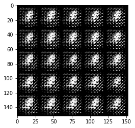
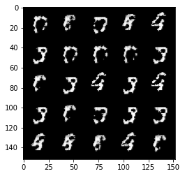
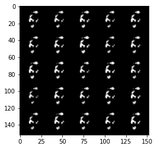
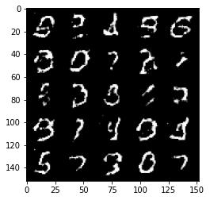
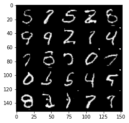

# DCGAN

# Google Colab / Your Device
directory system in my device and google colab is difference, so consider this cell

**NOTE:**  
> my device     :       "\"
> colab         :       "/"

# Generator
## Description
You may notice that instead of passing in the image **dimension**(e.g 784 in mnist dataset), you will pass the number of image 
**channels** to the generator.
because with DCGAN, you use convolutions which don’t depend on the **number of pixels (size)** on an image, just **input channels** and 
**number of filters(convolution)** are important.

**NOTE:**  
> in Basic GANS, we used `nn.Linear` submodules. for these GANS be important JUST number of input/output pixels (dimensions).

**Summary:**  
> Basic GANs    :   `nn.Linear(Dim_in, Dim_out)` (Dim_in : number of input nodes    Dim_out : number of output nodes)
> DCGANs        :   `nn.Conv2d(C_in, C_out)`     (C_in   : number of input channels C_out   : number of convolution filters)

**NOTE:**  
write about increase number of nodes in every layer for basic gans. but in DCGANs diminish number of channels in every layer.
but size of image increase every layer (deconvolution).

# Discriminator
## Description
as same as generator, we focus on number of channels in every layer. but size image diminish every layer and number of channels
increase every layer.

## Code
```python
class Discriminator(nn.Module):
    ...
    ...
    def forward(self, x):
            return self.dis(x).view(x.shape[0], -1)
```

**NOTE:**  
> output size of `self.dis(x)` is **(N, 1, 1, 1)**. since we want to feed this output to **Loss Function**, this value must be scaler.

# Noise
Because, DCGAN focus on number of channels, so `z_dim` put in **channel dimension (C_noise)**.
```python
def get_noise(N_noise, C_noise, device='cpu'):
    return torch.randn(N_noise, C_noise, device=device).view(N_noise, C_noise, 1, 1)
```

# Losses
as same as Basic GANs, but `torch.flatten` has been deleted.

# Hyperparameters
```python
# Sample numbers of noise and image
N_noise = 128
batch_size =128

# Channels of noise and image
C_noise = 64
C_image = 1

# Channels of hidden layers
C_hidden_gen = 64
C_hidden_dis = 16

# lr/epoch/disp
lr = 0.0002
beta_1 = 0.5
beta_2 = 0.999

# epochs
epochs= 50
disp_freq=100
```

# Save/Load Model 
> **WARNING:**  
> make a function that save parameters, epochs and etc every epoch. because the computation cost is so high and you must run 
> your code in google colab. and because of some limitations, it is possible that runtime become finish.

```python
def save_model(gen, dis, epoch, root, mode = None):
    # directory system in colab and pc is different.
    if mode == 'colab':
        filename = root + f'/model_epoch_{epoch}.pt'
    else:
        filename = root + f'\model_epoch_{epoch}.pt'

    torch.save({'epoch' : epoch,
              'model_dis_state_dict' : dis.state_dict(),
              'model_gen_state_dict' : gen.state_dict()},
              filename)
```

```python
# when you want to continue training GAN from last epoch.
def load_model(gen, dis, root):
    # root = last generator and discriminator parameters that has been saved.
    # gen  = un-initialized generator
    # dis  = un-initialized discriminator

    models=torch.load(root)
    gen.load_state_dict(models['model_gen_state_dict'])
    dis.load_state_dict(models['model_dis_state_dict'])
    return models['epoch']
```

# Create Models / Criterion / Optimizers
## re-initialize all submodules (submodules of Generator and Discriminator)
```python
def weights_init(submodules):
    if isinstance(submodules, nn.Conv2d) or isinstance(submodules, nn.ConvTranspose2d):
        torch.nn.init.normal_(submodules.weight, 0.0, 0.02)
    if isinstance(submodules, nn.BatchNorm2d):
        torch.nn.init.normal_(submodules.weight, 0.0, 0.02)
        torch.nn.init.constant_(submodules.bias, 0)
```

## Create Models / Criterion / Optimizers
```python
# get instance from models
gen = Generator(C_noise, C_hidden_gen, C_image).to(device)
dis = Discriminator(C_image, C_hidden_dis).to(device)

# Initialize
gen = gen.apply(weights_init)
dis = dis.apply(weights_init)

# Loss function
criterion=nn.BCEWithLogitsLoss()

# Optimizers
optim_dis = torch.optim.Adam(dis.parameters(), lr=lr, betas=(beta_1, beta_2))
optim_gen = torch.optim.Adam(gen.parameters(), lr=lr, betas=(beta_1, beta_2))
```

# Train 
as same as Basic GANs.

# Experiences
## 1st try
> Epoch: 1      Loss Dis: 0.78     Loss Gen: 0.61  


> Epoch: 50      Loss Dis: 0.43     Loss Gen: 1.83  


## 2nd try
```python
...
...
beta_1 = 0.5
beta_2 = 0.999

optim_dis = torch.optim.Adam(dis.parameters(), lr=lr, betas=(beta_1, beta_2))
optim_gen = torch.optim.Adam(gen.parameters(), lr=lr, betas=(beta_1, beta_2))
...
...
```

> Epoch: 50      Loss Dis: 0.12	    Loss Gen: 3.03  
> 

## 3th try
```python 
# NEW : try 3th
def weights_init(submodules):
    if isinstance(submodules, nn.Conv2d) or isinstance(submodules, nn.ConvTranspose2d):
        torch.nn.init.normal_(submodules.weight, 0.0, 0.02)
    if isinstance(submodules, nn.BatchNorm2d):
        torch.nn.init.normal_(submodules.weight, 0.0, 0.02)
        torch.nn.init.constant_(submodules.bias, 0)
gen = gen.apply(weights_init)
dis = dis.apply(weights_init)
```

> Epoch: 1      Loss Dis: 0.67	    Loss Gen: 0.72  
> 

> Epoch: 10      Loss Dis: 0.65	    Loss Gen: 1.29  
> 

> Epoch: 50      Loss Dis: 0.69    Loss Gen: 0.78  
> 