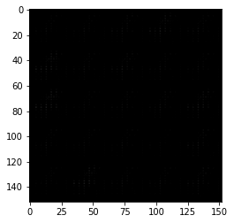

# DCGAN

# Generator

# Discriminator

# Noise

# Losses
Just delete flatten real image

# Hyperparameters

# Save Model 
> **WARNING:**  
> make a function that save parameters, epochs and etc every epoch. because the computation cost is so high and you must run 
> your code in google colab. and because of some limitations, it is possible that runtime become finish.

# Experiences
## 1st try
> Epoch: 1      Loss Dis: 0.78     Loss Gen: 0.61  


> Epoch: 50      Loss Dis: 0.43     Loss Gen: 1.83  


## 2nd try
```python
...
...
beta_1 = 0.5
beta_2 = 0.999

optim_dis = torch.optim.Adam(dis.parameters(), lr=lr, betas=(beta_1, beta_2))
optim_gen = torch.optim.Adam(gen.parameters(), lr=lr, betas=(beta_1, beta_2))
...
...
```

> Epoch: 50      Loss Dis: 0.12	    Loss Gen: 3.03  
> 

## 3th try
```python 
# NEW : try 3th
def weights_init(submodules):
    if isinstance(submodules, nn.Conv2d) or isinstance(submodules, nn.ConvTranspose2d):
        torch.nn.init.normal_(submodules.weight, 0.0, 0.02)
    if isinstance(submodules, nn.BatchNorm2d):
        torch.nn.init.normal_(submodules.weight, 0.0, 0.02)
        torch.nn.init.constant_(submodules.bias, 0)
gen = gen.apply(weights_init)
dis = dis.apply(weights_init)
```

> Epoch: 1      Loss Dis: 0.67	    Loss Gen: 0.72  
> 

> Epoch: 10      Loss Dis: 0.65	    Loss Gen: 1.29  
> 

> Epoch: 50      Loss Dis: 0.69    Loss Gen: 0.78  
> 