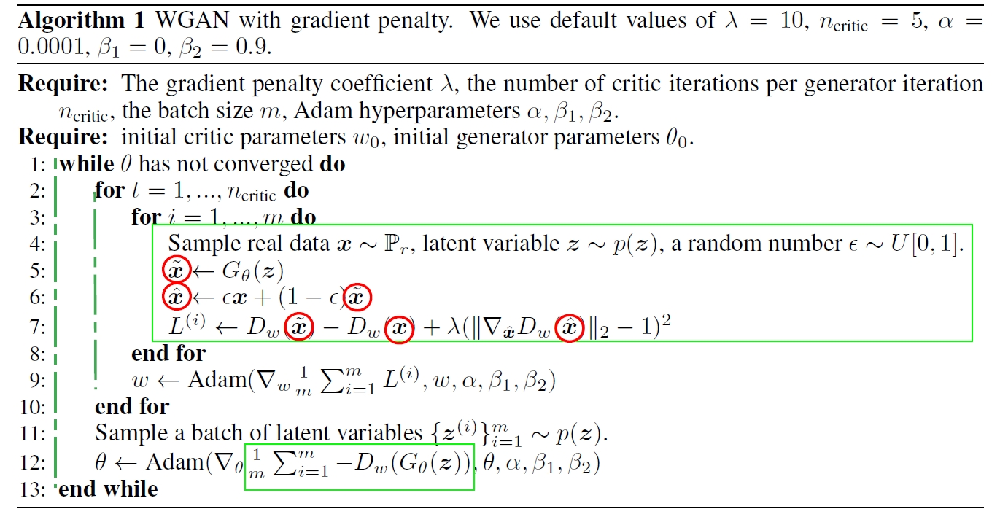
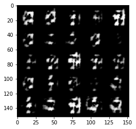
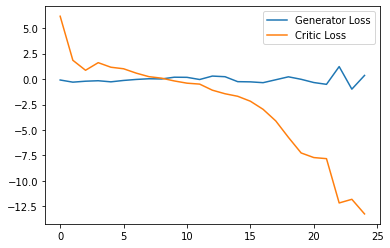
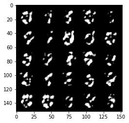
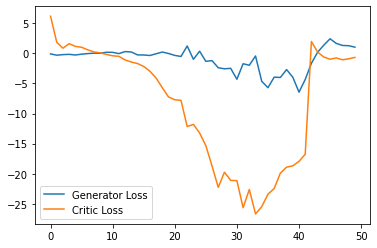
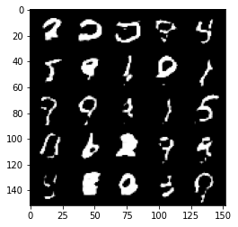
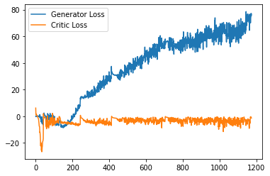
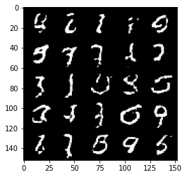
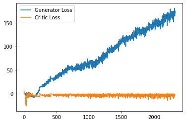

**Sources:**  
- [ ] https://jonathan-hui.medium.com/gan-gan-series-2d279f906e7b

**Content Table:** 
- [BCE](#bce)
- [WGAN](#wgan)
  - [Discriminator Loss](#discriminator-loss)
  - [Generator Loss](#generator-loss)
  - [Hyperparameter](#hyperparameter)
  - [Training (Learning)](#training-learning)
  - [Visualization](#visualization)
- [WGAN-GP](#wgan-gp)
    - [epsilon](#epsilon)
    - [Gradient of Discriminator with respect to desired data](#gradient-of-discriminator-with-respect-to-desired-data)
    - [Gradient Penalty given gradient](#gradient-penalty-given-gradient)
    - [Discriminator Loss](#discriminator-loss)
    - [Generator Loss](#generator-loss)
    - [Hyperparameter](#hyperparameter)
    - [Training (Learning)](#training-learning)
    - [Visualization](#visualization)
    - [Results](#results)
    - [Save Model](#save-model)
- [NOTE](#note)

# BCE
```python
def get_loss_dis(gen, dis,
                 real_image,
                 N_noise, C_noise,
                 device):

    x = real_image
    x_hat = gen( get_noise(N_noise, C_noise, device=device) ).detach()

    return torch.mean(-torch.log10(F.sigmoid(dis(x))), dim=0) + torch.mean(-torch.log10(1 - F.sigmoid(dis(x_hat))), dim=0 )
```

```python
def get_loss_gen(gen, dis,
                 N_noise, C_noise,
                 device):

    x_hat = gen( get_noise(N_noise, C_noise, device=device) )

    return torch.mean(torch.log10(1 - F.sigmoid(dis(x_hat))), dim=0 )
```

# WGAN

## Discriminator Loss
```python
def get_loss_dis(gen, dis,
                 real,
                 N_noise, C_noise,
                 device):

    # Generate fake image by Generator
    fake = gen( get_noise(N_noise, C_noise, device=device) ).detach()
    return ( dis(fake) - dis(real) ).mean(dim=0)
```

## Generator Loss
```python
def get_loss_gen(gen, dis,
                 N_noise, C_noise,
                 device):
    # Generate fake image by Generator
    fake = gen( get_noise(N_noise, C_noise, device=device))
    return ( -dis(fake) ).mean(dim=0)
```

## Hyperparameter
```python
# Sample numbers of noise and image
N_noise = 128
batch_size =128

# Channels of noise and image
C_noise = 64
C_image = 1

# Channels of hidden layers
C_hidden_gen = 64
C_hidden_dis = 16

# lr/epoch/disp
lr = 0.0002
beta_1 = 0.5
beta_2 = 0.999

# epochs
n_epochs = 100
display_step = 500
```

## Training (Learning)
```python
import matplotlib.pyplot as plt
cur_step = 0
generator_losses = []
critic_losses = []
for epoch in range(n_epochs):
    # Dataloader returns the batches
    for real, _ in tqdm(dataloader):
        cur_batch_size = len(real)
        real = real.to(device)

        ### Update critic ###
        optim_dis.zero_grad()
        crit_loss = get_loss_dis(gen, dis, real, cur_batch_size, C_noise, device)
        crit_loss.backward(retain_graph=True)
        optim_dis.step()
        # Keep track of the average critic loss in this batch
        critic_losses += [crit_loss.item()]

        ### Update generator ###
        optim_gen.zero_grad()
        gen_loss = get_loss_gen(gen, dis, cur_batch_size, C_noise, device)
        gen_loss.backward()
        optim_gen.step()
        # Keep track of the average generator loss
        generator_losses += [gen_loss.item()]
```

## Visualization
```python
for epoch in range(n_epochs):
    for real, _ in tqdm(dataloader):
        if cur_step % display_step == 0 and cur_step > 0:
            gen_mean = sum(generator_losses[-display_step:]) / display_step
            crit_mean = sum(critic_losses[-display_step:]) / display_step
            print(f"Epoch {epoch}, step {cur_step}: Generator loss: {gen_mean}, critic loss: {crit_mean}")

            fake_noise = get_noise(cur_batch_size, C_noise, device=device)
            fake = gen(fake_noise)

            show_tensor_images(fake)
            show_tensor_images(real)
            step_bins = 20
            num_examples = (len(generator_losses) // step_bins) * step_bins
            plt.plot(
                range(num_examples // step_bins),
                torch.Tensor(generator_losses[:num_examples]).view(-1, step_bins).mean(1),
                label="Generator Loss"
            )
            plt.plot(
                range(num_examples // step_bins),
                torch.Tensor(critic_losses[:num_examples]).view(-1, step_bins).mean(1),
                label="Critic Loss"
            )
            plt.legend()
            plt.show()
            
        cur_step += 1
```

# WGAN-GP


## epsilon 
because, `x` and `x_hat` in algorithm, have shape of `(N, 1, 28, 28)`, so we consider shape of epsilon `(N, 1, 1, 1)`
```python
def get_epsilon(N_epsilon, device='cpu'):
    return torch.rand(N_epsilon, 1, 1, 1, device=device, requires_grad=True)
```

## Gradient of Discriminator with respect to desired data
Later, we will use `mixture_data` in argument of `data`.

```python
def get_gradient(dis, data):
    """
    Return the gradient of the critic's scores with respect to mixes of real and fake images.
    Parameters:
        dis: the critic model
        data: a batch of data
    Returns:
        gradient: the gradient of the discriminator's scores, with respect to data
    """

    # True require_grad of Data
    data.requires_grad_()
    # Calculate the discriminator's scores on the data
    score = dis(data)

    # Take the gradient of the scores with respect to the data
    gradient = torch.autograd.grad(
        inputs=data,
        outputs=score,
        # These other parameters have to do with the pytorch autograd engine works
        grad_outputs=torch.ones_like(score),
        create_graph=True,
        retain_graph=True,
    )[0]
    return gradient
```

## Gradient Penalty given gradient

```python
def gradient_penalty(gradient):
    '''
    Return the gradient penalty, given a gradient.
    Given a batch of data gradients, you calculate the magnitude of each data's gradient
    and penalize the mean quadratic distance of each magnitude to 1.

    Parameters:
        gradient: the gradient of the discriminator's scores, with respect to the data
        e.g shape  : (128, 1, 28, 28)

    Returns:
        penalty: the gradient penalty
        e.g shaoe : (scaler)
    '''

    # Flatten the gradients so that each row captures one image
    # e.g shape  : (128, 1, 28, 28) ==> (128, 784)
    gradient = gradient.view(len(gradient), -1)

    # Calculate the magnitude of every row
    # e.g shape : (128, 784) ==> (128, 1)
    gradient_norm = gradient.norm(2, dim=1)

    # Penalize the mean squared distance of the gradient norms from 1
    # e.g shape : (128, 1) ==> (scaler)
    penalty = ( ( gradient_norm - 1.0 )**2 ).mean(dim=0)
    return penalty
```

## Discriminator Loss
```python
def get_loss_dis(gen, dis,
                real,
                N_noise, C_noise,
                c_lambda,
                device):
    '''
    Parameters:
        All as same as DCGAN Losses
    Returns:
        dis_loss: a scalar for the dis's loss
    '''
    
    # Generate fake image by Generator
    fake = gen(get_noise(N_noise, C_noise, device))
    # Mixed "real" with "fake"
    epsilon = get_epsilon(N_epsilon = N_noise, device=device)
    mixed_images = real * epsilon + fake * (1 - epsilon)
    # Calculate Gradient Penalty (use prior funcs)
    gp = gradient_penalty(get_gradient(dis, mixed_images))
    # Calculate "Line 7" of "Algorithm 1" in main paper
    return ( dis(fake) - dis(real) + c_lambda * gp ).mean(dim=0)
```

## Generator Loss
```python
def get_loss_gen(gen, dis,
                N_noise, C_noise,
                device):
    '''
    Return the loss of a generator.
    Parameters:

    Returns:
       a scalar loss value for the current batch of the generator
    '''

    # Generate fake image by Generator
    fake = gen(get_noise(N_noise, C_noise, device))
    # Calculate "Line 12" of "Algorithm 1" in main paper
    return ( -dis(fake) ).mean(dim=0)
```

## Hyperparameter
```python
...
...
# NEW
crit_repeats = 5
c_lambda = 10
...
...

```

## Training (Learning)
```python
...
...
for epoch in range(n_epochs):
    # Dataloader returns the batches
    for real, _ in tqdm(dataloader):
        ...
        ...
        mean_iteration_critic_loss = 0
        for _ in range(crit_repeats):
            ### Update critic ###
            ...
            crit_loss = get_loss_dis(gen, dis, real, N_noise, C_noise, c_lambda, device)
            ...
            mean_iteration_critic_loss += crit_loss.item() / crit_repeats
        critic_losses += [mean_iteration_critic_loss]

        ### Update generator ###
        ...
        gen_loss = get_loss_gen(gen, dis, cur_batch_size, C_noise, device)
        ...
        generator_losses += [gen_loss.item()]
```

## Visualization
as same as WGAN

## Results
### Epoch 01
  


### Epoch 02
  


### Epoch 50
  


### Epoch 100
  


## Save Model
**WGAN-GP-Epoch-100.pt** put in Repository.

```python
def save_model(gen, dis, epoch, cur_step, generator_losses, critic_losses, root, mode = None):
    # directory system in colab and pc is different.
    if mode == 'colab':
        filename = root + f'/model_epoch_{epoch}.pt'
    else:
        filename = root + f'\model_epoch_{epoch}.pt'

    torch.save({'epoch' : epoch,
              'model_dis_state_dict' : dis.state_dict(),
              'model_gen_state_dict' : gen.state_dict(),
              'cur_step' : cur_step,
              'generator_losses' : generator_losses,
              'critic_losses' : critic_losses},
              filename)
```

# NOTE
1. Use `Detach` in section that it is not important that require_grad of tensor be existed (True/False)
2. Be careful about **Line 5,6** Algorithm 1 in original paper (these are different).
3. BE careful about Line 7 (**We draw a red circle on these**)